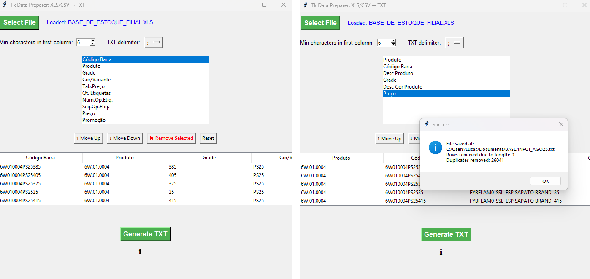

# Tk Data Preparer


**Tk Data Preparer** is a Python Tkinter GUI tool to clean, preprocess, and export tabular data (`Excel`, `CSV`, `TXT`).
It provides a configurable data preparation pipeline (cleaning → filtering → deduplication) with presets for common use cases.

---

## Features / Business Rules

- Import Excel, CSV, or TXT files.
- Interactive GUI built with Tkinter.
- Remove extra spaces from all string columns.
- Filter rows based on a minimum character length in the first column.
- Remove duplicates based on the first column.
- Export the cleaned and formatted data to a semicolon-delimited TXT file.
- Tooltips provide guidance throughout the interface.

---

## Demo

<p align="center">
  
</p>

---

## Installation

Clone the repository:

```bash
git clone https://github.com/lcspires/tk-data-preparer.git
cd tk-data-preparer
```

Create a virtual environment (recommended):

```bash
python -m venv .venv
source .venv/bin/activate   # Linux/macOS
.venv\Scripts\activate      # Windows
```

Install dependencies:

```bash
pip install -r requirements.txt
```

Or install the package in editable mode:

```bash
pip install -e .
```

---

## Usage

Run the GUI application:

```bash
python -m tk_data_preparer.app
```

1. Select an Excel, CSV, or TXT file.
2. Reorder and select the columns you want to keep.
3. Set the minimum number of characters for the first column.
4. Click "Generate TXT" to save the cleaned data.

## Test

Tests are written using pytest. To run:

```bash
python -m pytest -q
```

- Cleaning extra spaces in string columns.
- Filtering rows by minimum character length.
- Removing duplicates based on the first column.

---

## Project Structure

```bash
tk-data-preparer/
├── tk_data_preparer/
│   ├── __init__.py
│   ├── app/
│   │   ├── __init__.py
│   │   ├── main.py
│   │   ├── tooltip.py
│   │   └── widgets/
│   │       └── __init__.py
│   ├── core/
│   │   ├── __init__.py
│   │   ├── cleaning.py
│   │   ├── filtering.py
│   │   ├── deduplication.py
│   │   └── pipeline.py
│   ├── utils/
│   │   └── __init__.py
│   └── config.py
├── tests/
│   ├── __init__.py
│   ├── test_cleaning.py
│   ├── test_filtering.py
│   ├── test_deduplication.py
│   ├── test_pipeline.py
│   └── test_gui.py
├── requirements.txt
├── README.md
├── LICENSE
├── .gitignore
└── pyproject.toml
```

---

## Optional: Create an Executable

If you want to package **Tk Data Preparer** as a standalone executable for Windows, you can use tools like **PyInstaller**:

```bash
pip install pyinstaller
```

Then, from the root of your project:

```bash
pyinstaller --onefile --windowed -n "Tk Data Preparer" tk_data_preparer/app.py
```

- --onefile: bundles everything into a single .exe.
- --windowed: suppresses the terminal window when running the GUI.
- -n "Tk Data Preparer": sets the name of the executable.

After building, you'll find the executable in the dist/ folder.

---

## License

This project is licensed under the **MIT License**.  
You are free to use, copy, modify, merge, publish, distribute, sublicense, and/or sell copies of this software, provided that the original copyright notice and this permission notice are included in all copies or substantial portions of the software.  

For the full license text, see the [LICENSE](LICENSE) file.

## Author

**Lucas Ferreira**  
[LinkedIn: https://www.linkedin.com/in/lucasopf/]